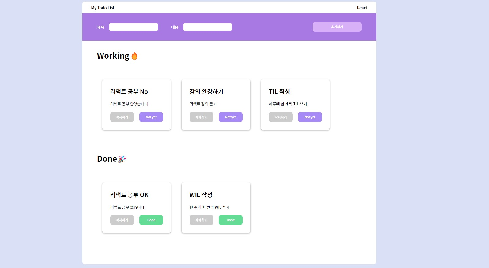

## 📒 리액트 TODO-LIST

#### 1. 프로젝트 Description

TODO-LIST로 React 기초 실습하기. 컴포넌트 단위로 나누어 하나의 프로젝트 완성해 보기.

App 보러가기 : https://hanghae-react-todo-list.vercel.app/

##### TODO-LIST 화면 이미지

## 

#### 2. 컴포넌트 구조 설계 : 반복되는 UI 및 구조상 컴포넌트화가 필요한 부분 컴포넌트로 생성

- InputBar 컴포넌트 : todo 입력을 받는 모아놓은 Bar 컴포넌트 입니다.

- Input 컴포넌트 : 내용을 입력받는 input을 재사용하기 위해 컴포넌트화 하였습니다.

- Button 컴포넌트 : button을 재사용하기 위해 컴포넌트화 하였습니다.

- TodoList 컴포넌트 : todo를 보여주는 list 컴포넌트 입니다.

- Todo 컴포넌트 : todo입력을 받은 내용을 보여주는 컴포넌트 입니다.
